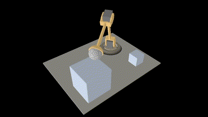
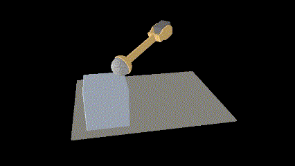

# Renderer72
A real-time renderer based on Vulkan.

***This page contains many GIFs so it may take some time to load them.***

### v1.0

Scene loader & Simple material & Animation:

Frustum culling:

### v2.0

Skybox & Tone mapping:

Normal mapping:

Displacement mapping:

PBR material & IBL & Precomputing environment map

A scene with only a quad (All the "geometry" is achieved with normal mapping and displacement mapping):

### v3.0

Spot light & Perspective shadow mapping:

Sphere light & Omnidirectional shadow mapping:

Directional light & Cascade shadow mapping:

Visualization of cascade levels:

### v4.0

Deferred Shading & SSAO:

A scene with 1024 sphere lights and 10000 PBR spheres:

