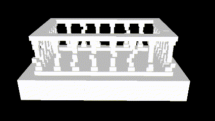

# Renderer72
Course Project of CMU 15-672 (Real-Time Graphics).

### v1.0

Scene loader & Simple material & Animation:

Frustum culling:

### v2.0

Skybox & Tone mapping:

Normal mapping:

Displacement mapping:

PBR material & IBL & Precomputing environment map

A scene with only a quad (All the "geometry" is achieved with normal mapping and displacement mapping):

https://drive.google.com/file/d/1bQg8eNA9uQESr8KSzsU2sSQSnGc3jxc2/view?usp=sharing

https://drive.google.com/file/d/1kL9O7fXrAfvcI59cQ6m9idj87cPcVaQd/view?usp=sharing

### v3.0 (Under development)

Analytical lighting & Shadow mapping
